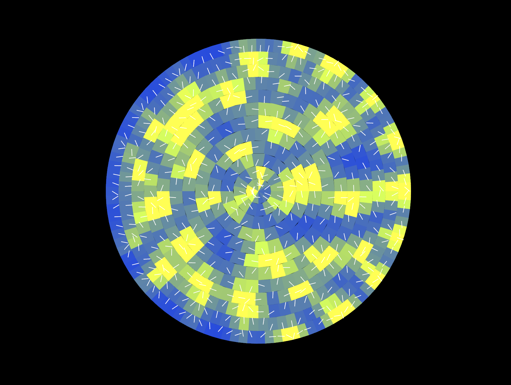

# Phyllotaxis Simulation (Smith et al., PNAS 2006)

Interactive phyllotaxis simulation in Rust using Bevy. It models auxin transport with PIN polarity on a polar ring grid, initiates primordia when auxin exceeds a threshold, and renders a basic mesh heatmap with PIN arrows.

## Controls
- Space: Pause/Resume
- R: Reset field and primordia
- [: Decrease transport rate
- ]: Increase transport rate

## Run

Prerequisites: Rust toolchain and a Vulkan/Metal/DirectX backend (wgpu). On macOS, Metal is used by default.

```bash
cargo run --release
```

## Example



## Notes
- This is a simplified, plausible implementation inspired by Smith et al. (PNAS 2006), not a quantitative reproduction. Parameters are exposed in code (`SimParams`).
